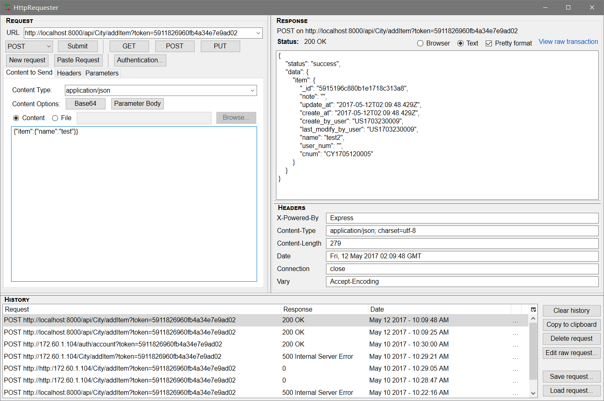

<!-- TOC depthFrom:1 depthTo:6 withLinks:1 updateOnSave:1 orderedList:0 -->

- [数据接口](#数据接口)
	- [1、添加一条记录(addItem)](#1添加一条记录additem)
	- [2、通过id获取一条记录(getById)](#2通过id获取一条记录getbyid)
	- [3、通过cnum获取一条记录(getByNum)](#3通过cnum获取一条记录getbynum)
	- [4、通过id删除一条记录(deleteById)](#4通过id删除一条记录deletebyid)
	- [5、通过cnum删除一条记录(deleteByNum)](#5通过cnum删除一条记录deletebynum)
	- [6、通过id更新一条记录(updateById)](#6通过id更新一条记录updatebyid)
	- [7、通过cnum更新一条记录(updateByNum)](#7通过cnum更新一条记录updatebynum)
	- [8、通过filter获取一条或多条记录(fetch)](#8通过filter获取一条或多条记录fetch)

<!-- /TOC -->
**注意**:exclamation::exclamation::exclamation:<br>
*
	所有接口请求时都必须有token，token在用户登录后的localStorage中；请求url的model名首字母一律大写<br>
	可以通过fireFox的httpRequseter插件测试接口:
	
*

# 数据接口

##  1、添加一条记录(addItem)

- **请求URL**
> [/api/model/addItem](#)

- **请求方式**
>**POST**

- **请求参数**

| 请求参数 | 参数类型 |           示例           |
| -------- | -------- | ------------------------ |
| item     | json     | {"item":{"name":"武汉"}} |


- **返回结果示例**
>    
```json
{
    "status": "success",
    "data": {
        "item": {
            "_id": "5912b14e902e40457009934f",
            "note": "",
            "update_at": "Thu May 11 2017 11:21:32 GMT+0800 (中国标准时间)",
            "create_at": "Thu May 11 2017 11:21:32 GMT+0800 (中国标准时间)",
            "create_by_user": "",
            "last_modify_by_user": "",
            "name": "武汉",
            "user_num": "",
            "cnum": "CY1705100007"
        }
    }
}
```


## 2、通过id获取一条记录(getById)

- **请求URL**
> [/api/model/getById](#)

- **请求方式**
>**POST**

- **请求参数**

| 请求参数 | 参数类型 |                示例                 |
| -------- | -------- | ----------------------------------- |
| id       | json     | {"id":"5912b14e902e40457009934f"} } |


- **返回结果示例**
>    
```json
{
    "status": "success",
    "data": {
        "item": {
            "_id": "5912b14e902e40457009934f",
            "note": "",
            "update_at": "Thu May 11 2017 11:21:32 GMT+0800 (中国标准时间)",
            "create_at": "Thu May 11 2017 11:21:32 GMT+0800 (中国标准时间)",
            "create_by_user": "",
            "last_modify_by_user": "",
            "name": "武汉",
            "user_num": "",
            "cnum": "CY1705100007"
        }
    }
}
```


## 3、通过cnum获取一条记录(getByNum)

- **请求URL**
> [/api/model/getByNum](#)

- **请求方式**
>**POST**

- **请求参数**

| 请求参数 | 参数类型 |            示例            |
| -------- | -------- | -------------------------- |
| cnum     | json     | {"cnum":"CY1705100007"}  } |


- **返回结果示例**
>    
```json
{
    "status": "success",
    "data": {
        "item": {
            "_id": "5912b14e902e40457009934f",
            "note": "",
            "update_at": "Thu May 11 2017 11:21:32 GMT+0800 (中国标准时间)",
            "create_at": "Thu May 11 2017 11:21:32 GMT+0800 (中国标准时间)",
            "create_by_user": "",
            "last_modify_by_user": "",
            "name": "武汉",
            "user_num": "",
            "cnum": "CY1705100007"
        }
    }
}
```


## 4、通过id删除一条记录(deleteById)

- **请求URL**
> [/api/model/deleteById](#)

- **请求方式**
>**POST**

- **请求参数**

| 请求参数 | 参数类型 |            示例            |
| -------- | -------- | -------------------------- |
| id     | json     | {"id":"5912b14e902e40457009934f"} |


- **返回结果示例**
>    
```json
{
    "status": "success",
    "data": {
        "item": {
            "delete": "ok"
        }
    }
}
```


## 5、通过cnum删除一条记录(deleteByNum)

- **请求URL**
> [/api/model/deleteByNum](#)

- **请求方式**
>**POST**

- **请求参数**

| 请求参数 | 参数类型 |            示例            |
| -------- | -------- | -------------------------- |
| cnum     | json     | {"cnum":"CY1705100007"} |


- **返回结果示例**
>    
```json
{
    "status": "success",
    "data": {
        "item": {
            "delete": "ok"
        }
    }
}
```


## 6、通过id更新一条记录(updateById)

- **请求URL**
> [/api/model/updateById](#)

- **请求方式**
>**POST**

- **请求参数**

| 请求参数 | 参数类型 |            示例            |
| -------- | -------- | ------------------------ |
| id, item     | json   | {"id":"5912b14e902e40457009934f","item":{"name":"武汉2"}} |


- **返回结果示例**
>    
```json
{
    "status": "success",
    "data": {
        "item": {
            "_id": "5912b14e902e40457009934f",
            "note": "",
            "update_at": "2017-05-12T03:19:14.779Z",
            "create_at": "Thu May 11 2017 11:21:32 GMT+0800 (中国标准时间)",
            "create_by_user": "",
            "last_modify_by_user": "",
            "name": "武汉2",
            "user_num": "",
            "cnum": "CY1705100007"
        }
    }
}
```


## 7、通过cnum更新一条记录(updateByNum)

- **请求URL**
> [/api/model/updateByNum](#)

- **请求方式**
>**POST**

- **请求参数**

| 请求参数 | 参数类型 |            示例            |
| -------- | -------- | -------------------------- |
| cnum, item     | json     | {"cnum": "CY1705100007","item":{"name":"武汉3"}}|


- **返回结果示例**
>    
```json
{
    "status": "success",
    "data": {
        "item": {
            "_id": "5912b14e902e40457009934f",
            "note": "",
            "update_at": "2017-05-12T03:22:49.044Z",
            "create_at": "Thu May 11 2017 11:21:32 GMT+0800 (中国标准时间)",
            "create_by_user": "",
            "last_modify_by_user": "",
            "name": "武汉3",
            "user_num": "",
            "cnum": "CY1705100007"
        }
    }
}
```


## 8、通过filter获取一条或多条记录(fetch)

- **请求URL**
> [/api/model/fetch](#)

- **请求方式**
>**POST**

- **请求参数**

| 请求参数 | 参数类型 |            示例            |
| -------- | -------- | -------------------------- |
| filter    | json     | {"filter": "","limit":10,"orderBy":"createAt","startPos":0}|


- **返回结果示例**
>    
```json
{
    "status": "success",
    "data": {
        "list": [
            {
                "_id": "5912b14e902e40457009934f",
                "note": "",
                "update_at": "2017-05-12T03:22:49.044Z",
                "create_at": "Thu May 11 2017 11:21:32 GMT+0800 (中国标准时间)",
                "create_by_user": "",
                "last_modify_by_user": "",
                "name": "武汉3",
                "user_num": "",
                "cnum": "CY1705100007"
            },
            {
                "_id": "5912b145902e40457009934e",
                "note": "",
                "update_at": "2017-05-10T06:20:53.383Z",
                "create_at": "2017-05-10T06:20:53.383Z",
                "create_by_user": "",
                "last_modify_by_user": "",
                "name": "杭州",
                "user_num": "",
                "cnum": "CY1705100006"
            },
            {
                "_id": "5912b006902e40457009934b",
                "note": "",
                "update_at": "2017-05-10T06:15:34.787Z",
                "create_at": "2017-05-10T06:15:34.787Z",
                "create_by_user": "",
                "last_modify_by_user": "",
                "name": "上海",
                "user_num": "US1703160010",
                "cnum": "CY1705100005"
            },
            {
                "_id": "5912affb902e40457009934a",
                "note": "",
                "update_at": "2017-05-10T06:15:23.875Z",
                "create_at": "2017-05-10T06:15:23.875Z",
                "create_by_user": "",
                "last_modify_by_user": "",
                "name": "北京",
                "user_num": "US1703160011",
                "cnum": "CY1705100004"
            }
        ],
        "count": 4
    }
}```
